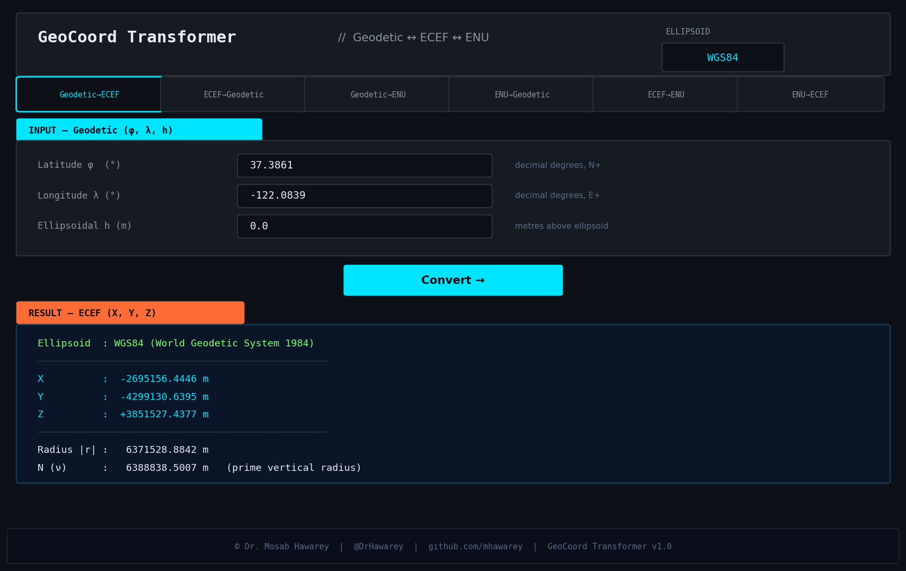

# GeoCoord Transformer

[](https://opensource.org/licenses/MIT)

A desktop GUI application for geodetic coordinate system transformations, built with Python and Tkinter.



## Transformations Supported

| Conversion | Description |
|---|---|
| **Geodetic → ECEF** | (φ, λ, h) → (X, Y, Z) |
| **ECEF → Geodetic** | (X, Y, Z) → (φ, λ, h) — Bowring iterative method |
| **Geodetic → ENU** | (φ, λ, h) → (East, North, Up) w.r.t. local origin |
| **ENU → Geodetic** | (E, N, U) → (φ, λ, h) |
| **ECEF → ENU** | (X, Y, Z) → (East, North, Up) |
| **ENU → ECEF** | (East, North, Up) → (X, Y, Z) |

## Ellipsoid Models

| Model | Semi-major axis (a) | Flattening (1/f) | Usage |
|---|---|---|---|
| **WGS84** | 6,378,137.000 m | 298.257223563 | GPS, global standard |
| **GRS80** | 6,378,137.000 m | 298.257222101 | ITRS, ETRS89 |
| **Bessel 1841** | 6,377,397.155 m | 299.152813 | Europe, old European surveys |
| **Clarke 1866** | 6,378,206.400 m | 294.978698 | NAD27, North America |

## Requirements

```
Python >= 3.8
tkinter (included with standard Python on Windows/macOS)
```

No external packages required.

## Usage

```bash
python main.py
```

On Windows, double-click `run.bat`.

## Math

- **Geodetic → ECEF**: Direct closed-form using prime vertical radius of curvature N(φ)
- **ECEF → Geodetic**: Bowring iterative method (converges to 1e-12 rad in <10 iterations)
- **ECEF ↔ ENU**: Rotation matrix using local geodetic frame at origin (φ₀, λ₀)

## Author

**Dr. Mosab Hawarey**
>
PhD, Geodetic & Photogrammetric Engineering (ITU) | MSc, Geomatics (Purdue) | MBA (Wales) | BSc, MSc (METU)

- GitHub: https://github.com/mhawarey
- Personal: https://hawarey.org/mosab
- ORCID: https://orcid.org/0000-0001-7846-951X

## License

MIT License
